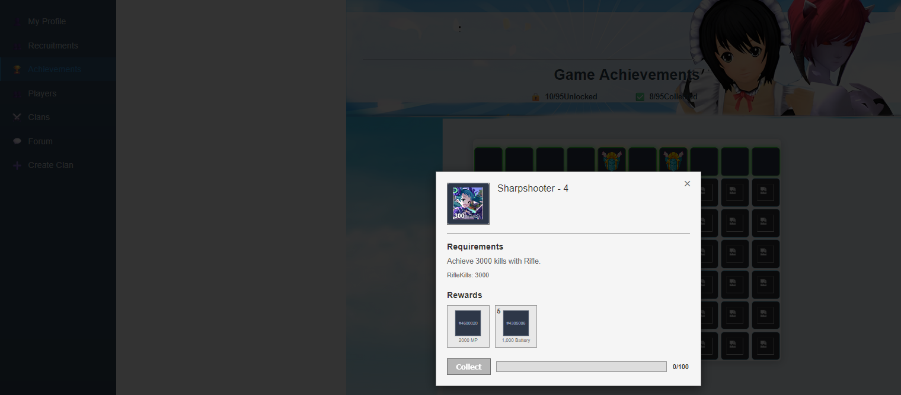

```
    |  \/  | \ \ / /  / _ \  
    | |\/| |  \ V /  | (_) | 
    |_|__|_|  _\_/_   \___/  
    _|"""""|_| """"|_|"""""| 
    `-0-0-'  `-0-0-'  `-0-0-` 
    
MVO v0.5
```
## Overview
A recreation of the Previous Microvolts reward systems, bringing back the reward mechanics from Microvolts Unplugged and ToyHeroes Offline.  something I'd wanted to build for a while out of nostalgia for the original systems.

A couple of videos showcasing the original reward systems:
[https://www.youtube.com/watch?v=Wq3uV1y7X6I](https://www.youtube.com/watch?v=JjKTigTB0WI)
https://www.youtube.com/watch?v=ZG2P97g2UyI
https://www.youtube.com/watch?v=DG5uh2NjYb8

## Project Status
I'm no longer actively working on this project as I haven't had the time or motivation to keep this repo maintained. If you'd like to continue the work or take it in your own direction, feel free to fork it. check the [TODO](TODO.md) list for what's left.


## Features
- Referral Wheel
- Event Shop
- Achievement system
- daily playtime chest

### Achievement GUI Status
The GUI was built with EJS, which is a server-side templating engine. it's not designed for building interactive UIs. There's no component model, no layout system, and managing CSS at scale with it is painful. The result is what you'd expect: scaling is off and it's not responsive. It works well enough to hit endpoints and verify backend behavior, but that's the limit.

If you want a proper interface, write a separate frontend using a real framework (React, Vue, Svelte, pick one). The API is fully functional, so it's just a matter of connecting it.



The project heavily relies on the [ToyBattlesHQ](https://github.com/SoWeBegin/MicrovoltsEmulator) emulator's API, credits to the author. Note that the repo has since been taken down due to a DMCA.
### Installation & Configuration
check out [Installation & Configuration](Setup%20and%20configuration.md)
